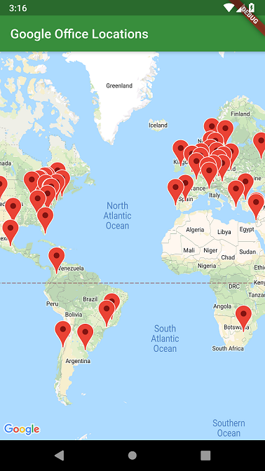

# google_maps_on_flutter

> Google Maps on Flutter using official Google maps Plugin for Flutter

The sample app displays Google Office locations on the world map using a JSON Web Service written in Dart by hitting the Google Maps API Endpoint and displaying the markers accordingly

